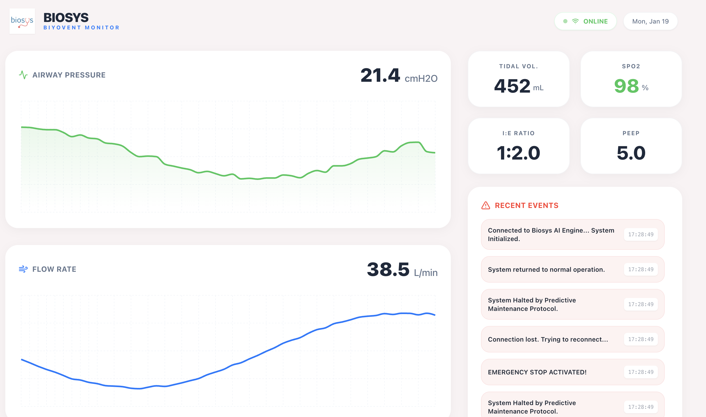

Biosys - Predictive Ventilator Monitor (PoC)

✨ Project Overview

This project is developed as a Proof of Concept (PoC) for Biosys, demonstrating a next-generation ventilator monitoring dashboard. It integrates real-time data visualization with a Python-based AI predictive engine to detect potential device failures before they occur.

The system simulates ventilator telemetry data and uses a Linear Regression model to predict critical threshold breaches up to 20 seconds in advance, triggering automated safety protocols.

✨ Key Features

  - Real-Time Monitoring: High-frequency data streaming via WebSockets for immediate visualization of pressure, airflow, and oxygen levels.
  - AI Predictive Engine: Custom NumPy based Linear Regression model that analyzes telemetry trends to forecast failures.
  - Auto-Safety Protocol: Automated "Emergency Stop" trigger when the AI confidence score predicts a critical failure.
  - Interactive Dashboard: Built with React 18 & Recharts for dynamic data plotting.

🛠 Tech Stack

Frontend

  - Framework: React 18 (TypeScript)
  - State Management: Redux Toolkit
  - Visualization: Recharts
  - Testing: Vitest

Backend

  - API: Python FastAPI
  - Data Processing: NumPy (for AI/Math operations)
  - Testing: Pytest
  - Communication: WebSockets

⚙️ Getting Started

Prerequisites

  - Node.js v18+
  - Python v3.9+

1. Backend Setup (FastAPI)

The backend handles the simulation logic and the AI prediction engine.

# Navigate to the backend directory
cd backend

# Create a virtual environment
python -m venv venv

# Activate the virtual environment
# Windows:
venv\Scripts\activate
# Mac/Linux:
source venv/bin/activate

# Install dependencies
pip install -r requirements.txt

# Run the server
uvicorn main:app --reload

2. Frontend Setup (React)

The frontend visualizes the WebSocket stream and displays alerts.

# Navigate to the frontend directory
cd frontend

# Install dependencies
npm install

# Start the development server
npm run dev

🧪 Running Tests

The project includes unit tests for both the predictive algorithm and the UI components.

Backend Tests:

cd backend
pytest

Frontend Tests:

cd frontend
npm run test

📸 Usage

1.  Start both Backend and Frontend servers.
2.  Open http://localhost:5173 (or the port shown in your terminal).
3.  Click "Start Simulation" to begin the telemetry stream.
4.  Observe the "Status" indicator; it will change from Normal to Warning or Critical based on the AI's predictions.
